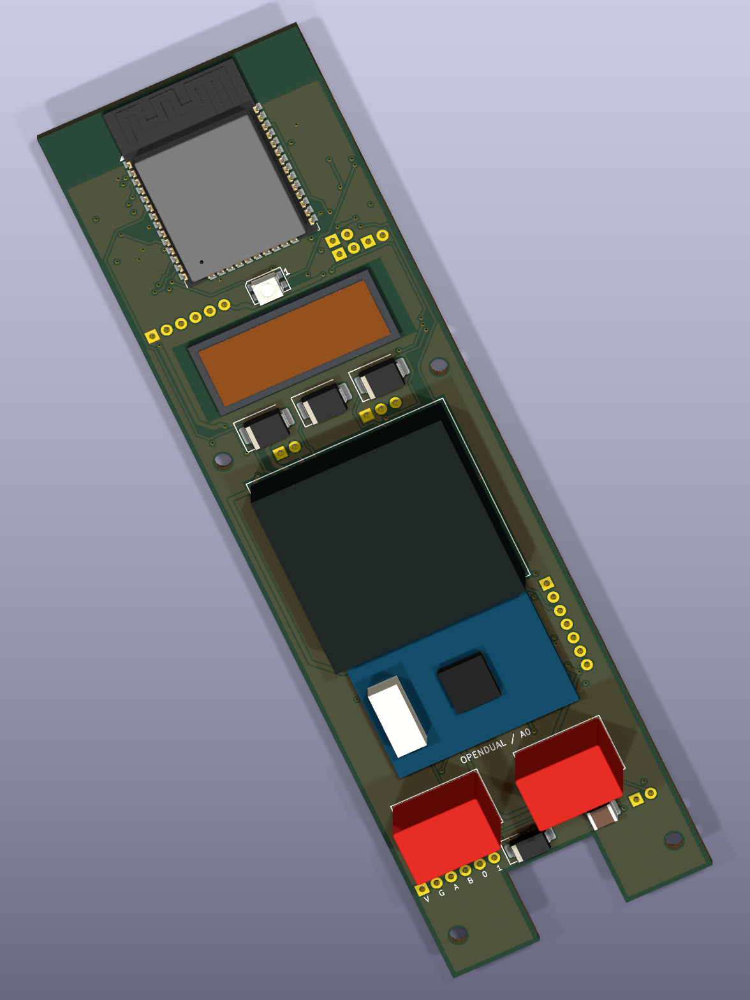

# OpenDual Reader — A0 engineering prototype

Editable ESP32 dual-frequency reader hardware and compiled Arduino firmware. **Not released for fabrication.** Read the [actual validation results](docs/validation-results.md) and [open issues](docs/open-issues.md) before using these files.

## Why this project exists

OpenDual Reader was created to explore an open, inspectable access-control reader: editable circuitry, documented interfaces, reproducible firmware and an enclosure that can be adapted without depending on an opaque finished product. The goal is to identify both LF proximity credentials and HF NFC cards, preserve their complete values, and support interoperable panel interfaces. It is an independently engineered replacement concept, not a reverse-engineered commercial reader or a claim of equivalent security, credential support or environmental certification.

## What is complete

The A0 preliminary design includes a fully routed six-layer KiCad board, six-page schematic, local symbols/footprints/3D models, BOM, separate relay demonstration board, enclosure source and compiled enclosure meshes. Final KiCad checks report **0 ERC errors/warnings, 0 DRC violations, 0 unconnected items and 0 schematic/PCB parity issues**. All four firmware environments compile. GPIO/pad mapping and local model checks pass. No hardware was assembled, RF measured or panel interoperability tested.

**A0 accepts 9–16 V DC only. It does not support 24 V, Ethernet or PoE.** The requested two-variant revision is documented in [the A1 roadmap](docs/two-variant-roadmap.md); it is not presented as completed circuitry or firmware. A0's enclosure target remains 131.2 × 40.7 × 17.6 mm.



## Technologies

| Technology | Purpose and boundary |
|---|---|
| ESP32-WROOM-32E-N4 | Local processing, independent UARTs and SPI; 3.3 V logic |
| ID-12LA-HE, 125 kHz | Purchased module with internal antenna and closed decoder; documented EM and limited HID support, exact PDK credentials still need tests |
| PN5321 MINI V2, 13.56 MHz | Purchased HF module/antenna for ISO14443A UID identification; full 4/7/10-byte UIDs, not cryptographic authentication |
| RS-485 / OSDP PD | Panel-controlled access with LibOSDP Secure Channel and a unique provisioned device key |
| Wiegand | Protected open-collector outputs; conversion is explicitly configured and never silently truncates UIDs |
| RGB, piezo and tamper | Reader feedback and enclosure-open detection; remote tamper mechanism still needs fit validation |
| External relay expansion | Isolated demonstration of logic/coil/contact roles; lock current never passes through the reader board |
| KiCad / OpenSCAD / PlatformIO | Editable electronics, mechanical source and pinned Arduino builds |

## Get started

1. Download this complete folder or the repository ZIP; retain the directory structure so project-local library paths work.
2. Install KiCad 10 and open [the project](hardware/kicad/OpenDual-Reader.kicad_pro). The [schematic PDF](hardware/exports/schematic.pdf) and [six-layer layout](hardware/exports/pcb-layout.png) can be inspected without KiCad. Use View → 3D Viewer in the PCB Editor.
3. Read [architecture](docs/architecture.md), [pinouts](docs/pinout.md), [BOM](hardware/bom/BOM.md), [power budget](docs/power-budget.md), [stackup](docs/stackup.md) and [release holds](docs/open-issues.md). Resolve protection placement, mechanical tolerances and RF/credential questions before manufacturing.
4. To build firmware, install Python 3.12 and PlatformIO Core 6.1.18, then run the commands below. All dependencies and the vendored LibOSDP version are documented in [firmware/README.md](firmware/README.md) and [THIRD_PARTY.md](firmware/THIRD_PARTY.md).
5. Follow [bring-up](docs/bringup.md) with current-limited bench power. Verify rails and pin polarity before flashing. For OSDP, provision a unique SCBK over an isolated UART fixture and configure the matching panel key; normal firmware refuses plaintext fallback.

```sh
python -m pip install platformio==6.1.18
cd firmware
python -m platformio run -e opendual -e wiegand -e standalone -e provision
```

| Firmware build/version | Intended use |
|---|---|
| A0 `opendual` | OSDP Peripheral Device; the upstream panel authorizes access |
| A0 `wiegand` | Reader-only output; explicit panel format configuration required |
| A0 `standalone` | Empty-by-default local whitelist and bounded external demo relay |
| A0 `provision` | Maintenance image for unique keys/address; never a deployment mode |

Compiler logs, binaries and hashes are in [build-artifacts](firmware/build-artifacts/). Build versions and actual results are recorded in [firmware validation](docs/firmware-validation.md). These images target the A0 GPIO contract; they must not be flashed onto an unreviewed A1 board. Never commit provisioning records, SCBKs, private keys or live credentials.

## Review and contribute

Start with [open issues](docs/open-issues.md). Useful contributions include measured module/credential captures, RF coexistence data, protection-placement improvements, enclosure tolerance checks and reproducible panel tests. Report the board revision, firmware environment, exact parts and test setup. Keep measurements separate from assumptions. See [revision history](CHANGELOG.md) for the current scope.

Open `hardware/kicad/OpenDual-Reader.kicad_pro` in KiCad 10. In the PCB Editor, choose **View → 3D Viewer** (Alt+3). Drag to rotate and use the wheel to zoom. Toggle **F.Mask** and **B.Mask** in the viewer's Appearance panel to expose the outer copper. The [six-layer copper preview](hardware/exports/pcb-layout.png) shows internal routing too. Some RF assembly models are dimensional proxies, as described in the library notes.

Previews: [front 3D](hardware/exports/board-3d.png), [back 3D](hardware/exports/board-3d-back.png), [schematic overview](hardware/exports/schematic-overview.png), [complete schematic PDF](hardware/exports/schematic.pdf), [BOM](hardware/bom/BOM.md).

| Folder | Contents |
|---|---|
| `hardware/kicad/` | Native project, six-page schematic, six-layer carrier PCB and optional relay project |
| `hardware/libraries/` | Portable symbols, footprints, 3D assets and LF footprint notes |
| `hardware/bom/` | CSV and readable BOM |
| `hardware/exports/` | Schematic PDF, board images, assembly drawings and actual check reports |
| `mechanical/` | Editable OpenSCAD enclosure, compiled cover/backplate STLs, exploded preview, dimensioned drawings and fit analysis |
| `firmware/` | Arduino source, pinned LibOSDP, GPIO contract and compiled artifacts |
| `docs/` | Architecture, evidence, pinouts, power, RF, bring-up and validation |

The carrier is 36 × 124 mm with a 12 × 10 mm cable notch. The proposed enclosure retains the requested 131.2 × 40.7 × 17.6 mm exterior. The LF reader is ID Innovations ID-12LA-HE; the HF reader is ELECHOUSE PN5321 MINI V2. Purchased RF assemblies contain closed vendor firmware/ROM. Exact PDK wristband compatibility, HID bit mapping, RF coexistence and panel interoperability remain unverified.

OSDP runs as a Peripheral Device and requires Secure Channel with a unique provisioned key. Wiegand preserves complete explicitly selected credential lengths and defaults to refusing unverified mappings. Standalone mode uses an empty-by-default UID whitelist and a bounded external demonstration relay. UID matching is not cryptographic authentication.

Original hardware, CAD and documentation are dedicated under CC0-1.0; original firmware is MIT. Third-party library licenses remain applicable. No board was ordered, component purchased or device flashed. GitHub publication was explicitly requested by the project owner.


### Public firmware distribution

All four firmware variants include full source, pinned dependencies, build instructions, and successful build logs. Precompiled `.bin` and `.elf` artifacts are omitted after automated publication review flagged embedded compiler/debug metadata. Build locally using the commands above; any references elsewhere to saved build images describe the local validation run, not downloadable public binaries.
